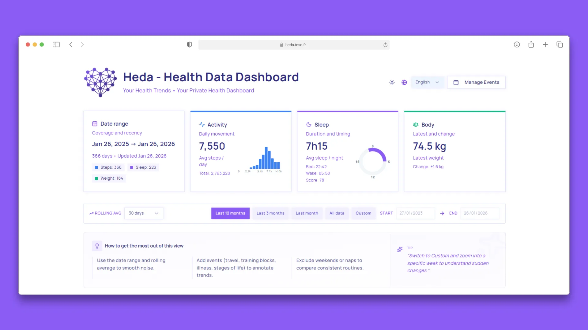
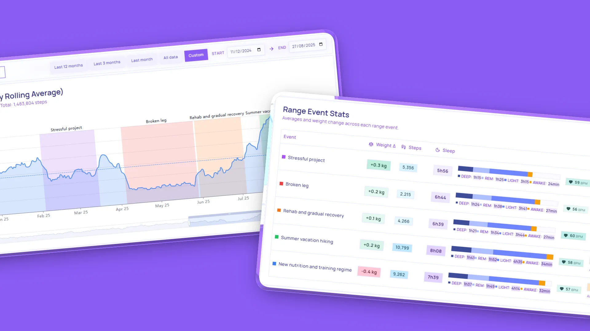
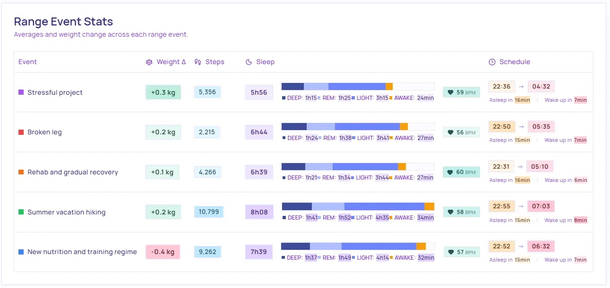
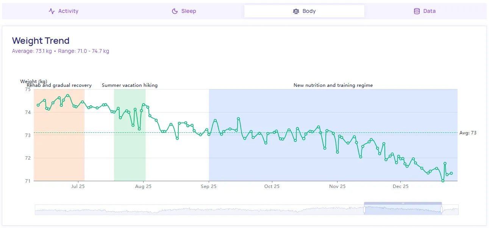

<div align="center">
<a href="https://heda.tosc.fr/" target="_blank">
   
   </a>
  <h3>Heda: Your Health Trends</h3>
  <p><em>Transforming your health data into actionable insights.</em></p>
  <a href="https://heda.tosc.fr/" target="_blank"><strong>Live Demo »</strong></a>
  <br />
  <br />
</div>

# Heda: Your Health Trends

**Heda - Health Data Dashboard** is an open-source dashboard for data from Withings devices (watch, scale, sleep tracker).
Instead of showing isolated numbers, it helps you understand trends over time so your data is easier to read and use, focusing on **clarity** and **insight**.



> **Note**: For now, Heda primarily supports data exports from the Withings ecosystem (Scanwatch, Body scales, Sleep Analyzer, etc.).

**Live Version**: [https://heda.tosc.fr/](https://heda.tosc.fr/)

Want to try it quickly? Use the [fake sample file](img/fake_withings_export.zip)

## How to use

1. Download your data archive from Withings (ZIP file).
2. Open [Heda](https://heda.tosc.fr/).
3. Upload the ZIP file.
4. Explore your charts and filters.

## Why Heda?

In an era of closed ecosystems and opaque data processing, Heda provides a **transparent, community-driven** alternative focused on full ownership and control of personal health data.

No account creation, no cloud sync, no setup inside the app.

- **Insight-Driven**: Charts are designed to support interpretation, not only display.
- **Data Clarity**: Optimized visualizations to see the signal through the noise.
- **Privacy First**: 100% local processing. No data ever leaves your device.
- **Open Source**: A community-led project committed to transparency and data ownership.

## Features



- **Open Source Health Dashboard**: A transparent tool for health or data enthusiasts to visualize data from their wearables and connected devices.
- **Actionable Trends**: Moving beyond point-in-time metrics to long-term health insights.
- **Offline-First Architecture**: Powered by IndexedDB for lightning-fast performance without an internet connection.
- **High-Fidelity Visualizations**: Interactive, deep-dive charts powered by Apache ECharts.

### Detect patterns

Add personal events to explain changes in your data


### Analyse patterns

Compare periods (for example: before/after a trip or routine change)



### Support steps, sleeps and weight data



## Privacy (important)

- Your file is processed in your browser.
- Your data stays on your device.
- Nothing is uploaded to a server by Heda.

If you clear data in the app, it is removed from your browser storage.

## For developers or to try locally

1. Clone the repository
2. Install dependencies and launch the project

```bash
npm install
npm run dev
```

## AI-Assisted Development Notice

> **Warning**: Parts of this project were generated or refined with generative AI tools. All generated code is manually reviewed, adapted, and validated before being kept in the codebase, but occasional inaccuracies may still exist.

## Join the Community

As an open-source project, Heda grows through contributions. New visualization ideas and support for additional health device ecosystems are always welcome to improve health data accessibility and understanding.

---

_Heda: Your Health Trends_
